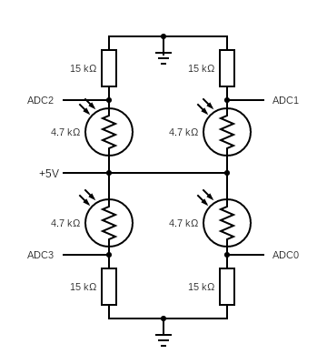

## Light tracker
This is a simple example of tracking a light source with a 2x servo driven pan & tilt mounted light sensor.  The light sensor consists of 4x light dependent resistors (LDR) mounted in a square pattern.  The resistance of each LDR is determined by connecting one pin of an LDR to 5V, the other pin to ground via a fixed resistor. The voltage between the LDR and resistor will vary in proportion to the intensity of the light illuminating the LDR. The voltage between each LDR and resistor pair is read by the analog to digital converter (ADC) of a microcontroller (attiny24).  
The controller reads each LDR voltage in sequence and then determine the difference in brightness between the four quadrants. The pan and tilt servos are then adjusted to move proportionally in the direction of the largest brightness gradient. When all four LDR sensors are evenly illuminated (basically when the sensor is perpendicular to the light source) the sensor stops moving.
